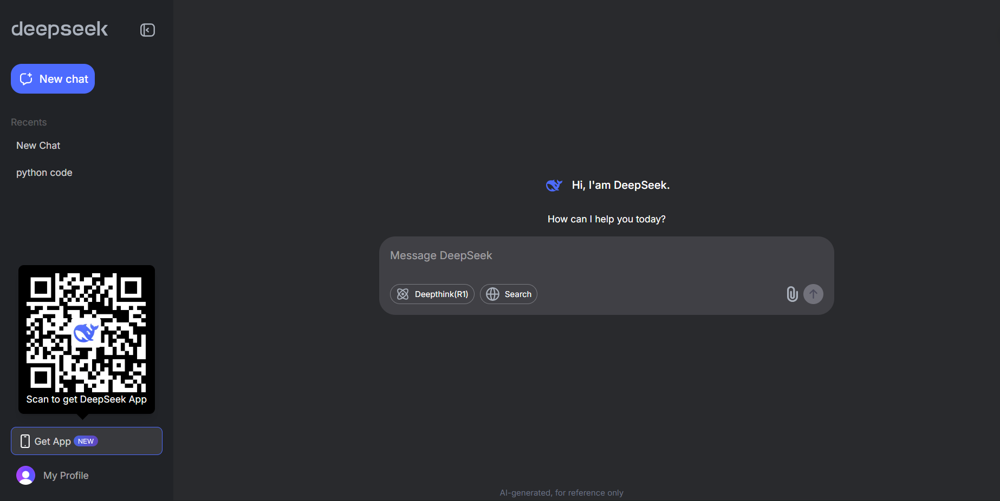
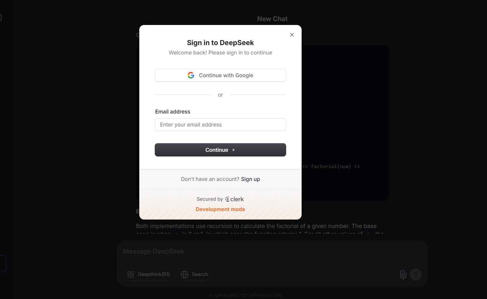
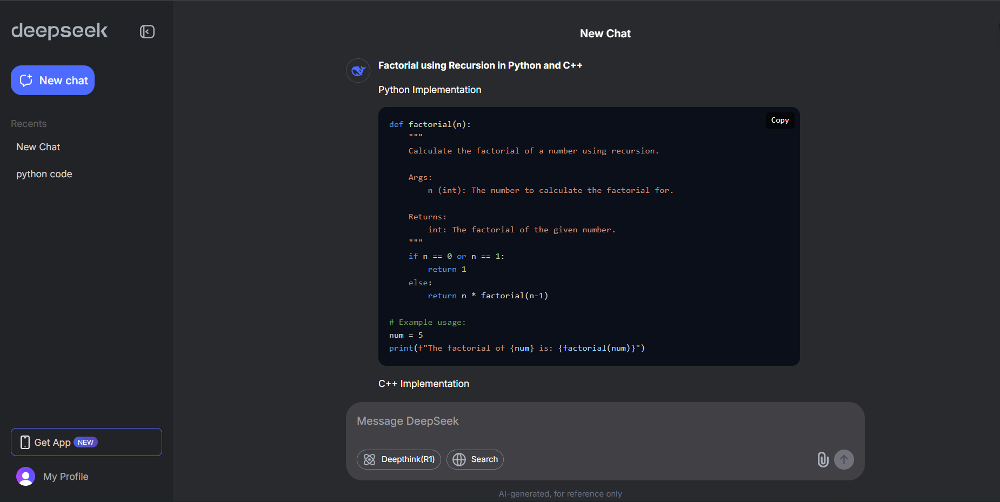
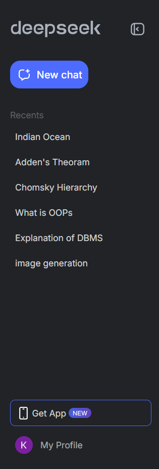

# DeepSeek AI Clone

<p align="center">
  
</p>

<p align="center">
  <strong>AI-powered conversational assistant inspired by DeepSeek</strong>
</p>

<p align="center">
  Built with Next.js, Clerk Authentication, MongoDB, and Google Gemini.
</p>

---

## Live Demo

🔗 **Demo:** `ADD_DEPLOYMENT_URL_HERE`

---

## Overview

DeepSeek AI Clone is a full-stack AI chat application that provides an intelligent conversational experience powered by Google Gemini. The platform includes secure authentication, persistent chat history, markdown rendering, and conversation management in a modern and responsive interface.

The goal of this project was to build a production-style AI assistant that demonstrates full-stack development, authentication, database integration, and AI API consumption.

---

## Features

### Authentication & Security

* Clerk Authentication
* Protected Routes
* User Session Management

### AI Conversations

* Google Gemini Integration
* Real-Time AI Responses
* Markdown Rendering Support

### Chat Management

* Create New Chats
* Persistent Chat History
* Delete Conversations
* User-Specific Chat Storage

### User Experience

* Responsive Design
* Modern UI
* Fast Navigation
* Optimized Performance

---

## Screenshots

### Home Page



---

### Authentication



---

### Chat Interface



---

### Chat History




---

## Tech Stack

### Frontend

* Next.js
* React
* Tailwind CSS

### Authentication

* Clerk

### Database

* MongoDB
* Mongoose

### AI

* Google Gemini API

### Deployment

* Vercel

---

## System Architecture

```text
User
 │
 ▼
Next.js Application
 │
 ├── Clerk Authentication
 │
 ├── Gemini API
 │
 └── MongoDB Database
        │
        ├── Users
        └── Chat History
```

---

## Project Structure

```text
app/
├── api/
├── chat/
├── components/
├── lib/
├── models/
├── public/
└── utils/
```

---

## Getting Started

### Clone Repository

```bash
git clone https://github.com/Kunaljain1392/Deepseek_project.git
cd Deepseek_project
```

### Install Dependencies

```bash
npm install
```

### Environment Variables

Create a `.env.local` file:

```env
MONGODB_URI=

NEXT_PUBLIC_CLERK_PUBLISHABLE_KEY=
CLERK_SECRET_KEY=

GEMINI_API_KEY=
```

### Run Development Server

```bash
npm run dev
```

Visit:

```text
http://localhost:3000
```

---

## Future Improvements

* File Upload Support
* Image Generation
* Chat Search Functionality
* Conversation Export
* Voice-Based Interactions
* Multi-Model AI Support

---

## Learning Outcomes

This project demonstrates practical experience in:

* Full-Stack Development
* Authentication & Authorization
* MongoDB Integration
* AI API Integration
* State Management
* Responsive UI Design
* Modern Next.js Architecture

---

## Author

**Kunal Jain**

GitHub: https://github.com/Kunaljain1392

---

## License

This project is intended for educational, learning, and portfolio purposes.
